# Project: MLOps platform for open-weight LMs
## Introduction
This project is a MLOps platform for designing, building, deploying, and monitoring a Lora fine-tuned Large language model incorporating all the workflows in the ML lifecycle using MLRun, AWS infrastructure (including GPUs), and open-source libraries. The input prompts can go up to 11,000 tokens.

The MLOps principles I follow include:
- Clear lineaage
- Reproducability
- Automation
- Artifacts generated at every stage

# Architecture
## Technology stack
Selecting a technology stack always begins with understanding the requirements of the project. This MLOps platform has to serve functions for:
1. The entire ML lifecycle
2. Accelerated computing with GPUs for open-weight models
3. A controller/manager for MLOps workflows
4. CI/CD

There are two main categories to choose and pick from:
- Open-source software (regular and kubernetes-native)
- Managed platforms (e.g.; Sagemaker, Vertex AI, Databricks, etc..)

## Managed vs open-source

Managed platforms have smaller upfront development workloads but their functionality is rigid and lacks much-needed customisability since you are restricted to what the provider offers while costing more money. Open-source software options offer nearly limitless customisability and integrations with other components, but the tradeoff is a significant increase in engineering work and knowledge required to build and maintain such a system in production. This translates to more time and work being spent on building a system using only open-source software. 

A tech stack selection using open-source and kubernetes-native software might look like this:

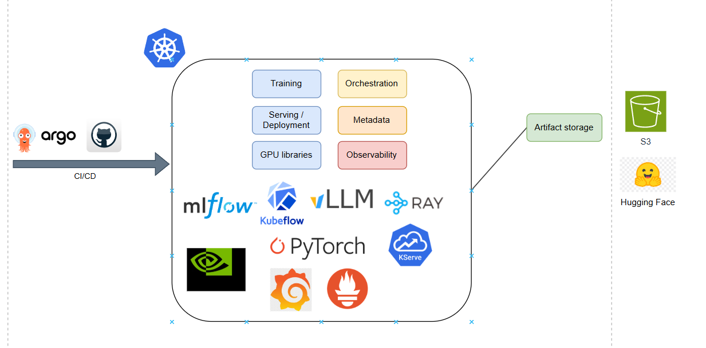

A tech stack only using a managed platform would simply be that platform.

I made the decision to use a combination of open-source and managed software because open-source offers me the flexibility of creating the customised workflows that I need to, and certain managed services (AWS) with sufficient customisability allows me to save large amounts of time developing solutions for common ML workloads while providing the functionality I need. This is my chosen tech stack:

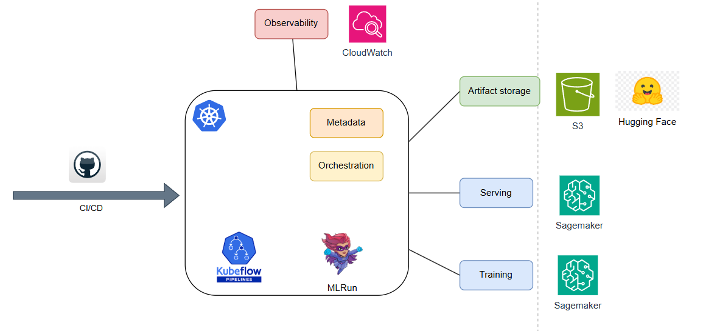

## Why the MLRun framework?
MLRun is an open-source MLOps orchestration framework for managing ML/GenAI applications across the entire ML lifecycle. There are a few reasons I chose to use this framework:
1. It allows me to create and orchestrate completely custom pipelines and run them as jobs on Kubernetes/Kubeflow pipelines.
2. It provides fully functional model/data/LLM prompt registries with various storage backends including S3.
3. It comes with Nuclio which allows me to create real-time functions that can be triggered by external events such as a **model drift detection alarm** on Amazon Cloudwatch.
4. Platform updates do not require updating the container images running on Kubernetes (they can be considered as static) which vastly reduces the complexity of the CI/CD pipeline.
5. It is offered as an open-source community version and a managed platform and is designed to be modular, so it facilitates easy switching the community version to the platform version.

## CI/CD pipeline
The deployment process of MLRun job functions (k8s batch jobs) are unique in that they do not require updating the containers running on Kubernetes. They are built and pushed to a container registry, then pulled at runtime to begin a job. These can be a variety of function types including kubeflow pipelines.

- https://docs.mlrun.org/en/stable/runtimes/create-and-use-functions.html#load-code-from-container
- https://docs.mlrun.org/en/stable/runtimes/image-build.html#working-with-code-repository
- https://docs.mlrun.org/en/stable/concepts/functions-overview.html

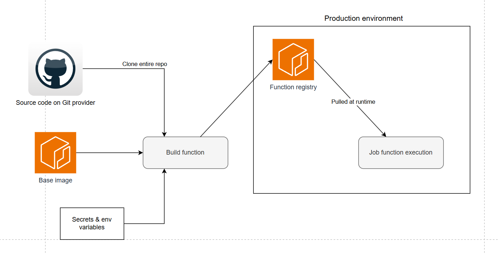

The CI/CD process that builds, tests, commits to version control, and deploys this platform that follows the recommended MLRun approach for production is like so:

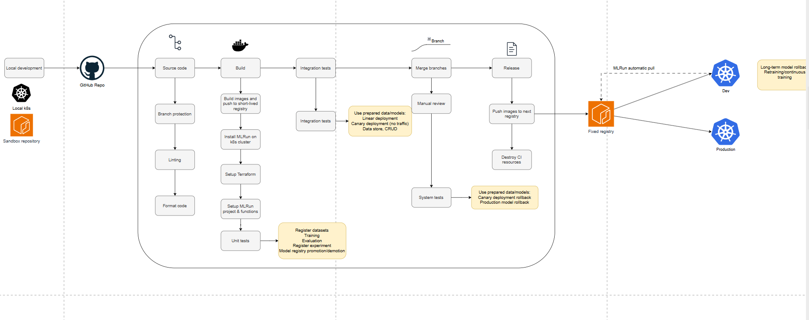
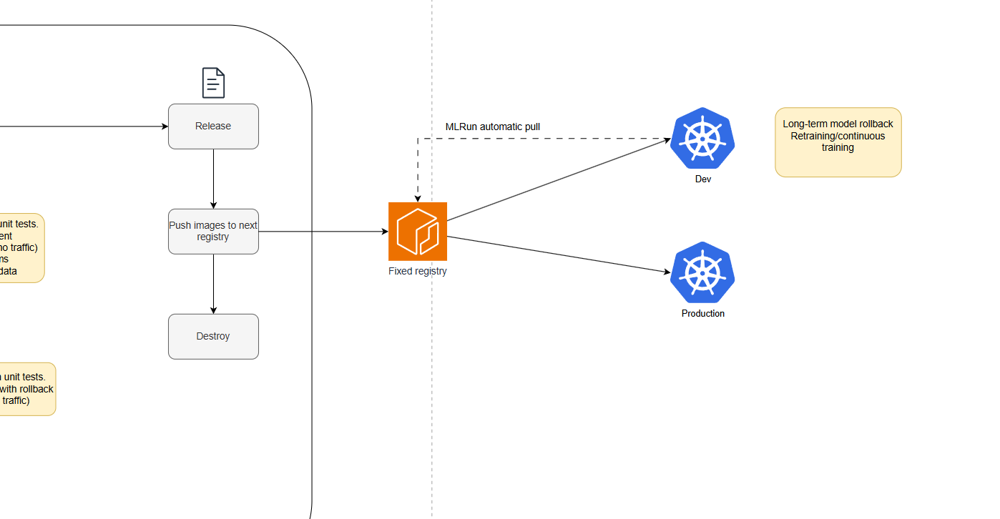

## Recommended project lifecycle
This is the recommended project lifecycle that incorporates CI/CD with Git from the official  MLRun documentation:
- https://docs.mlrun.org/en/stable/projects/git-best-practices.html
- https://docs.mlrun.org/en/1.11.x/cheat-sheet.html#ci-cd-integration
- https://docs.mlrun.org/en/1.11.x/cheat-sheet.html#git-integration

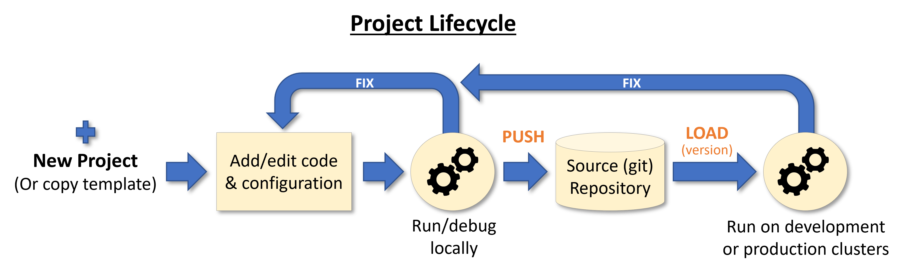
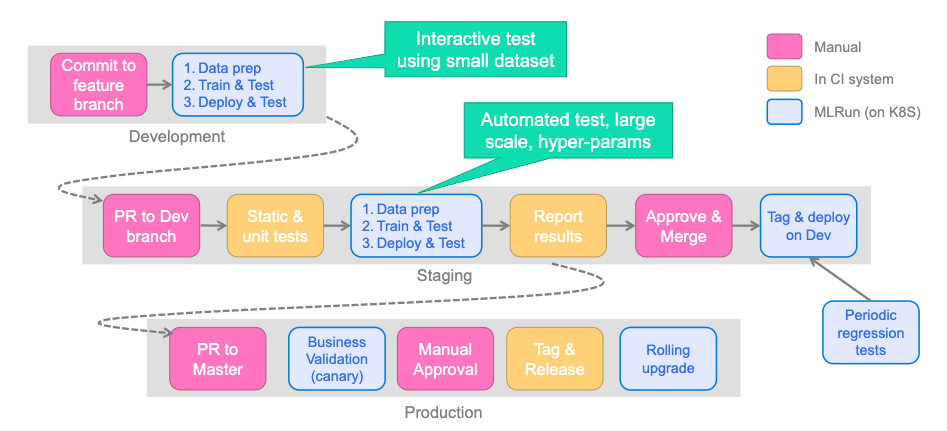


## MLRun Architecture
The main components of MLRun are:
- Projects and automation: https://docs.mlrun.org/en/stable/projects/project.html
- Functions: https://docs.mlrun.org/en/stable/runtimes/functions.html
- Workflows (function orchestration and runtimes): https://docs.mlrun.org/en/stable/concepts/runs-workflows.html
- Data and artifacts: https://docs.mlrun.org/en/stable/concepts/data.html
- Main advantages: https://docs.mlrun.org/en/stable/install-mlrun-ce/index.html

### This is a diagram of each component in the platform I have built using MLRun


### The MLRun components operate on a kubernets cluster, or on it's managed service

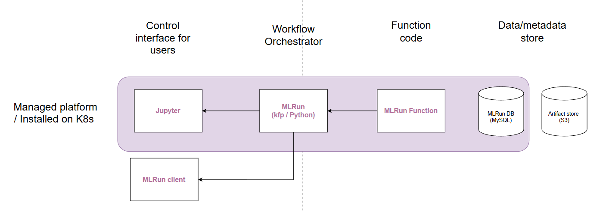

### Screenshots of the MLRun UI

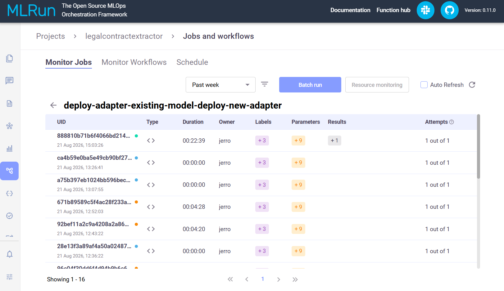
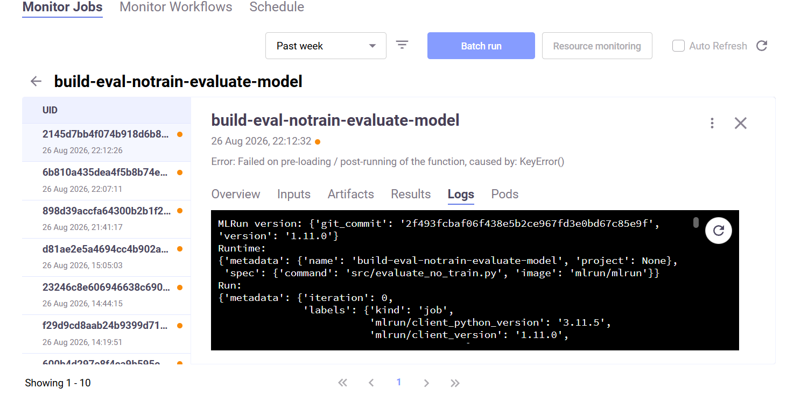

# Model

## The data science problem
Create a fine-tuned LLM that understands, extracts, and classifies risk/restriction/obligation clauses from multi-page non-disclosure-agreement contracts (taken from the Contract NLI dataset) up to 11,000 tokens long, and outputs structured JSON data with classification label, and source quote attribution.

This is the dataset I will be using. It was created by Yuta Koreeda and Christopher D. Manning from the Stanford NLP Group.
> ContractNLI is a dataset for document-level natural language inference (NLI) on contracts whose goal is to automate/support a time-consuming procedure of contract review.
- https://stanfordnlp.github.io/contract-nli/

## Performance metrics for evaluation and model drift
These metrics are calcualted with Rouge which is a n-gram evaluation method for matching identical text (unlike other NLP problems) between generated text and a reference. 
- Rouge Precision: fraction of n-grams in generated text also in the reference text
- Rouge Recall: fraction of ngrams from the reference text the generated text contained
- Rouge F-measure: Combination of precision and recall

### Metrics: Model performance evaluation
Uses F-measure because we want the necessary text to be captured, while the omitting redundant text.

### Metrics: Model drift monitoring
Uses Precision to ensure that the source_quote generated by the LLM occurs exactly as stated within the contract text.

The evaluation metrics used during **model evaluation** are numerous. This is an example:
```
{'count': 121, 'average_accuracy': 0.8762562296195846, 'average_fmeasure': 0.823687638956293, 't_average_fmeasure': 0.9220109736205447, 't_average_perc_above_75fmeasure': 0.8677144487608757, 'f_average_fmeasure': 0.11022039621650628, 'f_average_perc_above_75fmeasure': 0.08484848484848484, 'min_accuracy': 0.6470588235294118, 'min_t_average_fmeasure': 0.6596318005565962, 'min_t_perc_above_75fmeasure': 0.4, 'min_f_average_fmeasure': 0.0, 'min_f_perc_above_75fmeasure': 0.0}
```

I mainly look at the 2 main metrics (average accuracy and average fmeasure) and the rest to make sure they are within a threshold of minimum acceptable levels. A more in-depth writeup of rouge metrics and the specific one I have selected is in `src/utils_evaluate_model.py`


## Open-source models
Initial testing on several open-source models shows that Hermes 4 at 14B parameters by Noueresearch proved to have the best performance at a low parameter count. This is a post-trained version of Qwen 3. The native precision if 16-bit, the native format is 16bfloat.

https://huggingface.co/NousResearch/Hermes-4-14B

Test results of the base Hermes-4-14B model
```
results:
    count: 119
    average_accuracy: 0.7743450321304992
    average_fmeasure: 0.6653247764082815
    t_average_fmeasure: 0.8421043465572254
    t_average_perc_above_75fmeasure: 0.7567925854010876
    f_average_fmeasure: 0.054894841417625614
    f_average_perc_above_75fmeasure: 0.0374749899959984
    min_accuracy: 0.47058823529411764
    min_t_average_fmeasure: 0.06666666666666667
    min_t_perc_above_75fmeasure: 0
    min_f_average_fmeasure: 0
    min_f_perc_above_75fmeasure: 0
```

# MLOps pipelines and platform system design

## Requirements of the MLOps pipelines
The pipelines created in this project have to serve all stages of the ML lifecycle:
- Data curation
- Data preprocessing
- Train model
- Evaluate model
- Deploy model to production
- Monitor model in production
- Gather production data for retraining

## Workflows

### This diagram shows all the MLOps workflows in the platform


## Registries, pipelines, and other objects
These are registries with versioining that the MLRun api allows me to retrieve by specifiying an object key and object tag (version)
Registries created:
- Data registry for training datasets (train, test, validate)
- Model registry
- LLM prompt registry
- A data store for gathering production data

The pipelines I have created are:
- Process and register training datasets
- Preprocess, evalate a base model
- Preprocess, train, evaluate model with adapter
- Register model into registry
- Deploy model and adapter
- Deploy adapter

Deployment and model registry features include:
- Linear deployment
- Canary deployment with rollback
- Model drift monitoring (long-term)
- Champion/challenger/succeded model metadata for tracing deployed model lineage
- CloudWatch alarm objects

### These are the stages in a pipeline execution
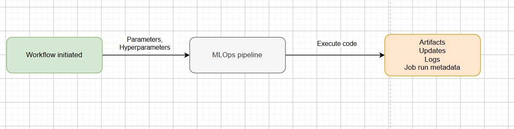

## AWS components
In the original architectural design at the beginning of this document, I chose to use a combination of open-source software and managed services that offer sufficient utility for this project to cut down development time instead of doing everything on Kubernetes. MLRun handles the orchestration, artifact registries (metadata), but the other functions of observability, storage, serving, deployment, and training use AWS services such as API gateway, Sagemaker, Lambda, AppConfig, Cloudwatch.

I use Lambda for the application logic that combines the prompt template with the user's input. This also creates an abstraction layer between the model service and API Gateway to simplify future migration and make the system design more extensible. I can now stream data to firehose for storage in an S3 bucket or send data to LangFuse which would not be possible. The model is currently served with Sagemaker endpoints, but in the future if I choose to switch to KServe and VLLM, I may do so.


### This diagram shows the design of the architecture that uses AWS services used in serving. 

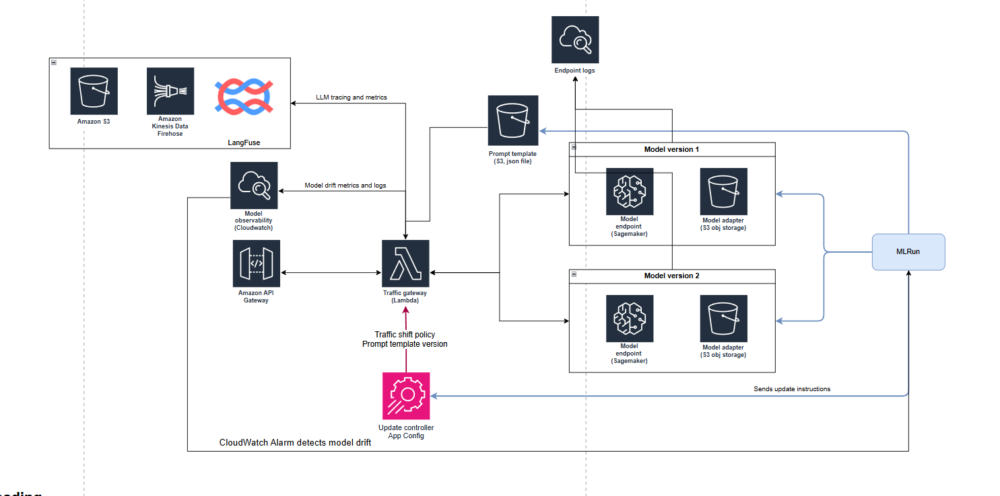

### This diagram shows how Appconfig and lambda are used in custom deployment configurations. 

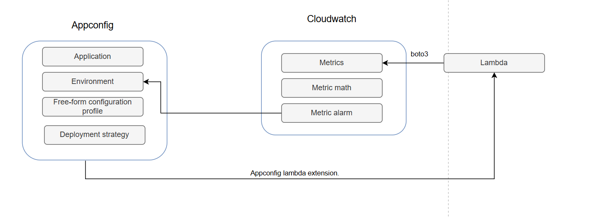

Traffic from clients passes through an API gateway to a serverless Lambda function that acts as a traffic gateway, logging and drift detection is measured on CloudWatch, and traffic movements for rolling model updates with rollbacks are controlled by AppConfig which is initiated by MLRun. When a CloudWatch alarm goes off during a rolling model update, AppConfig rollsback the lambda gateway to the old traffic configuration. Object storate is used to store the LLM system prompt, and the model adapters created during training. This uses Terraform to deploy.


## Data processing
Pyarrow, Datasets, Pandas, and Pytorch are used to process and preprocess data in the data store and preprocessing before model training. PyArrow and Datasets are useful for moving and transforming large datasets because they allow files to be processed in a stream when storage is separated from compute.

## Data storage
Object storage (S3) is used to store parquet files of data the train/validation/test split due to its efficient price-to-storage ratio (unlike databases). Model inference input & output captured in a production environment during operation is traced and sent to S3 through Data Firehose so that datasets of operational data can be enriched and combined with existing training datasets - facilitating ongoing model retraining for better performance.

## Data store
While the data store is not fully implemented in this project with bucket versioning. It uses S3 to store different versions of datasets as Parquet files across different sections of the data store, delineated with different buckets. CRUD operations will be built for appending rows of operational data to datasets from log files, and data enrichment operations.


## Model registry
The model registry keep track of registered models with versioning and the model's relevant metadata:
- Training parameters (including datasets)
- Performance metrics
- Training job run 
- Status (Standby, Challenger, Champion), with champion being the model in production. Code for tags is under `src/utils_model_registry.py`
- A traceable lineage of the models put in production through the "succeeded" tag

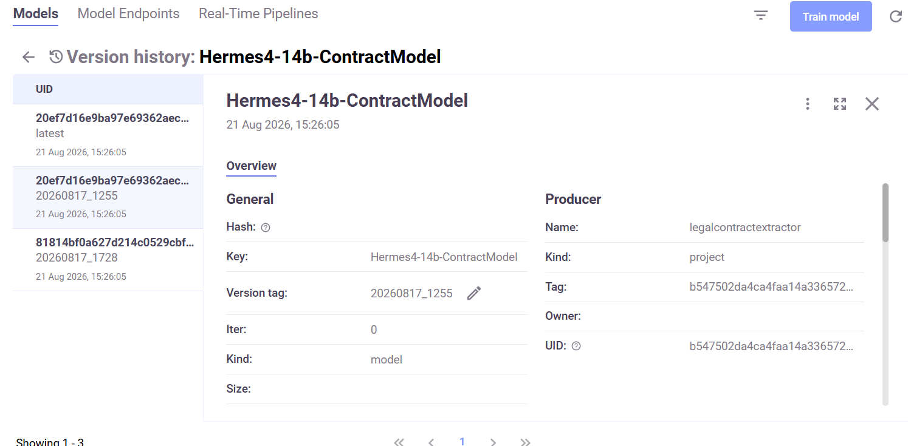

## Training and Sagemaker training jobs
Model training will be done with Sagemaker training jobs using G6e instances which have 48GB VRAM. This is a cost effective instance with sufficient memory for the 2000-11000 token system prompts. It does not have NVLink so tensor parallelism strategies are infeasible, and only data parallelism is possible. The Transformers library has a trainer which will be used as it integrates well with Sagemaker and the Hugging Model Repoistory through AWS DLC containers modified for the L40S architecture of the GPUs I am using https://aws.github.io/deep-learning-containers/reference/available_images/


I use Sagemaker training jobs on a G6e.12xlarge instance (four 48GB GPUs) because training infrastructure only needs to be transient, and spot instances are available for training which saves up to 90% of cost. Training checkpointing on S3 is available through the hugging face transformers library.

I created a custom image to use for training for this particular version of `Transformers` needed for qwen 3 and the L40s GPU archirecture under `images/sagemaker_train_job/`

## Parallelism for distribtued training on sagemaker
There are multiple parallelsim strategies offered by the SageMaker including DPP, TP, PP, FSDP
**Parallelism strategies offered**: https://docs.aws.amazon.com/sagemaker/latest/dg/model-parallel-intro-v2.html#model-parallel-intro-tp-v2

However I kept encountering compatability errors with the version of Transformers I was using because Qwen 3 is a relatively new model architecture that requires Transformers 4.51.3, and since I am using Sagemaker Training Jobs, there is very little flexibility offered in configuring versions of sagemaker/pytorch/transformers/CUDA installations in the DLC images offered. I decided to use the Pytorch DPP library for distributed training with a modified version of the provided Sagemaker-Transformers image available.

Tensor/Pipeline parallelsim are not needed since the model fits on a single G6e GPU, so DPP is sufficient. Pytorch DPP is used by configuring the options under `from sagemaker.huggingface import HuggingFace`.

## Training strategy
There is not a lot of data present in the data in the ContractNLI dataset. Fine-tuning is usually performed with a single epoch and at minimum a few thousand samples are the minimum. We only have 422 training samples, so I will use a multi-epoch strategy with early stopping based on deltas in the loss values at each observation.

The artifacts produced during and after training are:
- Learning curves of loss for the train/eval datasets during training to check for overfitting/underfitting/convergence
- Performance metrics on test dataset and output data
- The LoRA adapter 

## Graphs of the training job loss curves for two different training jobs
The evaluation frequency (frequency which to calcuate loss of the model against the evaluation dataset) was set to a specific number of steps (mini-batches) NOT a number of Epochs.

.png)

#### Lower batch size and learning rate
.png)


## Training hardware limitations of g6e instance
Hardware is a major limitation in this project due to the cost of accelerated compute instances. The prompts used for training go up to over 11,000 tokens, while the output can easily exceed 2000 tokens. As such, I have to use aggressive memory reduction methods during training to not run out of memory. I am using QLoRA, a 4-bit (NF4) form of mixed precision training using `bitsandbytes`, with a memory efficient 8-bit optimiser `paged_adamw_8bit`. 

## Artifact repository storage layer
I use S3 buckets to store versioned datasets, prompt templates. They should be versioned and regularly backed up in production.

I use the Hugging Face Model Hug Repo to store the base model, and to store versions of the LoRA adapters designated by their commit hash.

## Evaluation with vLLM and sagemaker training job
Custom evaluation metrics incorporating traditional ML metrics such as accuracy/recall/precision are used to measure the "correctness" of the labels of each hypothesis, and the NLP metric ROUGE will be used to evaluate the quality of the source attribution quotes. These are the main metrics for model evaluation. 

I also use a sagemaker training job to download the adapter that has been saved after the training job and use vLLM to create the inferences, once again making use of spot instances to save cost.

## Serving with vLLM and inference optimisation
Sagemaker model endpoints will be used for infrastructure, the backend vLLM (which uses flash attention) will be used as the inference backend due to its balance of strong performance and ease of setting up (unlike other options like TensorRT-LLM). `Continuous batching and quantisation` of the `model weights & KV cache` at FP8 (nearly no loss of accuracy) are the main inference optimisation strategy. Since a model fits on a single 48gb GPU, parallelism strategies (tensor/pipeline parallelism) are not necessary - each gpu on an instance (g6e.12xlarge has 4 L40S gpus) will serve independently (data parallelism).

I have to be very careful about balancing the batch size, `max-model-len`, `max-num-batched-tokens` parameters so that there are no memory bottlenecks during prefill or decode. These contract prompts are extremely long, memory has to be managed carefully.

This is the configuration used for vLLM with benchmarks viewable under `/benchmark/`. The code is in Python specified for the LMI deployed on Sagemaker real-time endpoints in `src/utils.py`

``` Python
lmi_config = {
        "HF_MODEL_ID": HF_MODEL_ID,
        "HF_TOKEN": os.environ['HF_TOKEN'], 
        "HF_REVISION": HF_REVISION,
        "SERVING_ENGINE": "Python", # https://docs.djl.ai/master/docs/serving/serving/docs/lmi/conceptual_guide/lmi_engine.html
        "OPTION_ROLLING_BATCH": "disable", #vllm disable
        "OPTION_ASYNC_MODE":"true",
        #"max" if enable tensor parallelism
        # 1 enables data parallelism since 1 model per gpu
        "TENSOR_PARALLEL_DEGREE": "1",
        "OPTION_ENTRYPOINT":"djl_python.lmi_vllm.vllm_async_service", # this is from article
        "OPTION_QUANTIZE":"fp8",
        "OPTION_KV_CACHE_DTYPE":"fp8",
        "OPTION_GPU_MEMORY_UTILIZATION":"0.95",
        # "OPTION_ENABLE_CHUNKED_PREFILL":"false",
        # "OPTION_ENABLE_PREFIX_CACHING":"false",
        # "OPTION_ENFORCE_EAGER":"true",
        "OPTION_MAX_MODEL_LEN":MAX_MODEL_LEN, # Max input + output = 6000 + 3000, this is a little buggy because requests close to but under 9000 tokens exceed this hard limit
        "MAX_BATCH_SIZE": BATCH_SIZE, # https://docs.djl.ai/master/docs/serving/serving/docs/lmi/user_guides/starting-guide.html
        "MAX_CONCURRENT_REQUESTS": "200",
        "OPTION_MAX_ROLLING_BATCH_SIZE":BATCH_SIZE, # this is in the amazon articles for async serving
        # https://docs.djl.ai/master/docs/serving/serving/docs/lmi/user_guides/vllm_user_guide.html#advanced-vllm-configurations
        "OPTION_MAX_NUM_BATCHED_TOKENS": BATCH_TOKENS,# Limits the number of tokens that can be processed in a single step during prefill
        # https://docs.vllm.ai/en/v0.8.3/serving/env_vars.html
        "VLLM_ATTENTION_BACKEND":"FLASHINFER", # TORCH_SDPA  FLASH_ATTN
        # The maximum time it will wait to receive a chunk of data from the Python backend. This is when waiting for previous batch to complete.
        "OPTION_PREDICT_TIMEOUT": str(60*15),
        "OPTION_MODEL_LOADING_TIMEOUT": str(60*20),
        "OPTION_TRUST_REMOTE_CODE": "true",
        "SERVING_FAIL_FAST":"true",
        
        "OPTION_ENABLE_LORA": "true", # Enable for dynamic Lora adapters, reserves chunk of KV cache VRAM
        "OPTION_MAX_LORA_RANK": "16",
        "OPTION_PARALLEL_LOADING": "true", # parallel model loading when loading multiple model workers, inc temp memory footprint
        "SERVING_JOB_QUEUE_SIZE": '500', # Default is 1000
    }
```

https://docs.vllm.ai/en/latest/configuration/engine_args/?h=engine+argumen#modelconfig

Speculative decoding may be included in the future.

## Endpoint autoscaling features
Sagemaker endpoint autoscaling allows autoscaling and allows an autoscaling policy to by attached to an andpoint. I am using values based on the performance benchmarks for a single instance endpoint to set the autoscaling targets. under `/benchmark`

However similar to kubernetes, under load is often slow and insufficient for low latency demands because of the memory size of the models and the serving container. A recently implement solution by AWS is container caching:

https://aws.amazon.com/blogs/machine-learning/introducing-container-caching-in-amazon-sagemaker-ai-for-faster-model-scaling/

## Model drift detection and rollbacks
Model drift detection is unable to compare an inference against the absolute ground truth by nature. So we often have to use heuristics to monitor for model drift. 
Statistical measures are used in traditional machine learning, while vector-embedding methods are used in text generation.

This model generates structured JSON data so I am able to implement model drift detection over the following metrics
### Label distribution values 
Label distribution values (entailment, contradiction, not_mentioned) of inferences for each hypothesis by hypothesis ID. These should remain within normal ranges that are deteremined during EDA. In practice, a hypothesis ID that is persistently outputs a label distribution of entailment:100 contradition:0 not_mentioned:0, is extremely suspicious behaviour and an indication of model drift.

### Rouge Precision scores
Ensure that the model has not hallucinated clauses that do not come from the contract, to ensure that source_quote is exactly from the contract.

### Model rollback workflow
This workflow uses the linear rollback deployment (defined in terraform) and a Nuclio Real-time function that activates instantly.

```
Traffic Gateway
      │
      ▼
CloudWatch Metrics
      │
      ▼
    Alarm
      │
      ▼
 EventBridge
      │
      ▼
MLRun Rollback real-time function

```

## Deployment
The deployment workflow involves deploying either a new model with an adapter, or just an adapter. 

The workflow involves deploying the model, performing pre-validation checks, switching the traffic gateway to point to the new endpoint either in a direct fashion or a rolling fashion, then finally creating a new set of model metric alarms for drift detection because cloudwatch metric alarms are retrospective and will read the results from the previous model if the same alarm is used for tracking the model's metics.
- Direct deployment 
- Canary deployment will rollback if model falls below threshold

#### Model and adapter deployment


#### Adapter deployment


## Canary update and rollbacks
Appconfig and Cloudwatch, Cloudwatch metric  are used in conjunction with the Lambda traffic gateway to monitor model performance in production with an **Appconfig Deployment strategy** that will roll back the gateway to the old traffic configuration (point 100% to the old model) when cloudwatch alarms go off.

#### Deployment rollback workflow
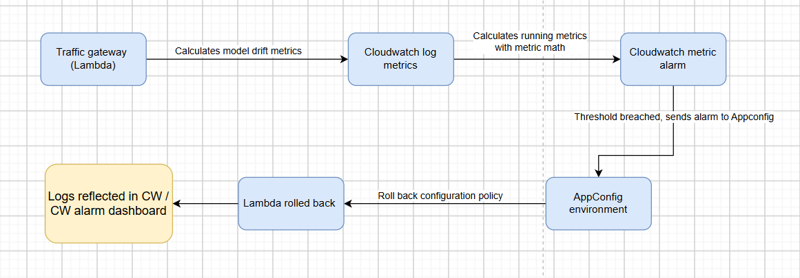

## Observability
We track a few data points during operation: Traces, Logs, Model performance metrics. Model tracing are extremely long stings of data and storing them in CloudWatch will cause cost to increase out of control - hence I use data firehose (microbatches) to write them to parquet files in S3, which also facilitates automated expansion of training datasets for `ongoing training`.

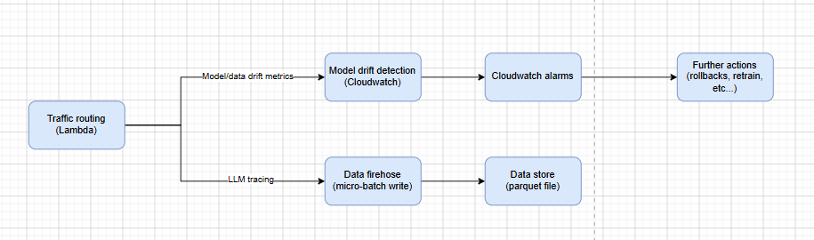


### AWS DLC images (sage, EC2, ECS, EKS)
https://aws.github.io/deep-learning-containers/reference/available_images/

### Memory consumption
Rough guide provided by DJL:
https://docs.djl.ai/master/docs/serving/serving/docs/lmi/deployment_guide/instance-type-selection.html


