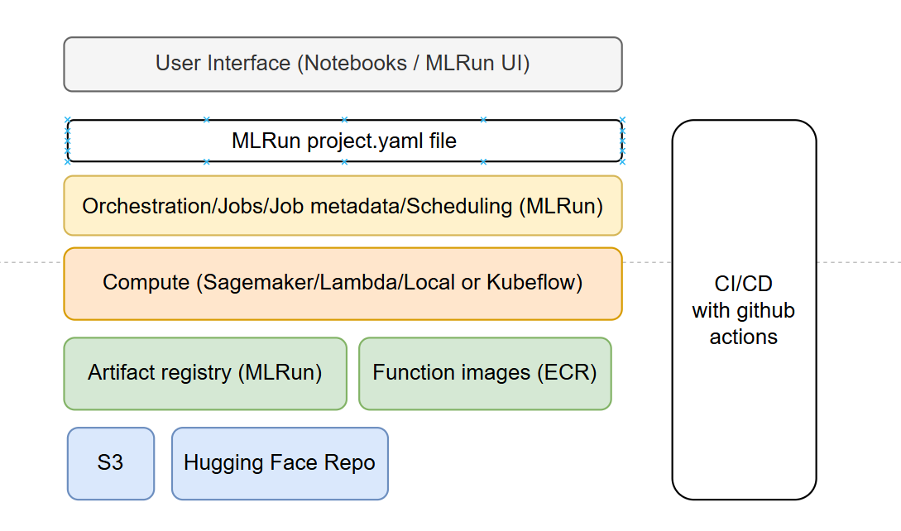
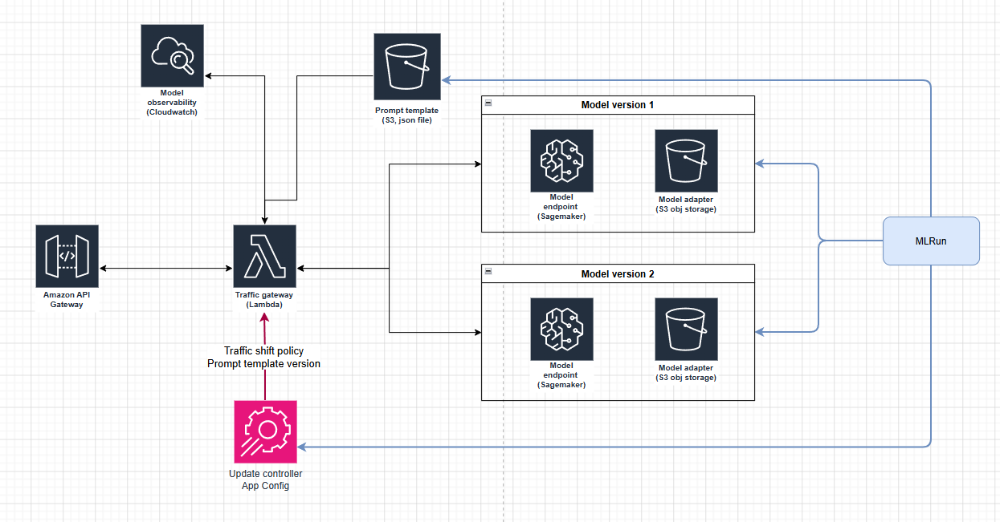
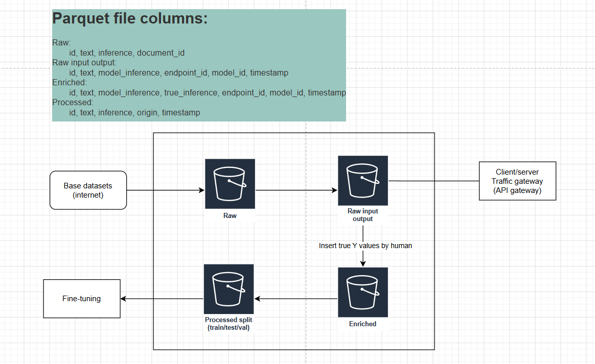
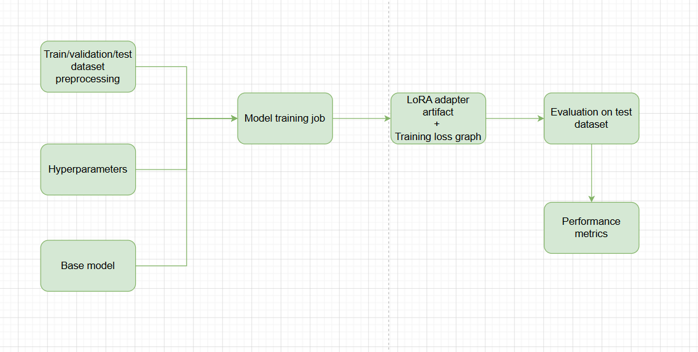
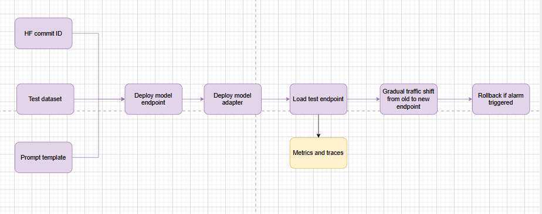
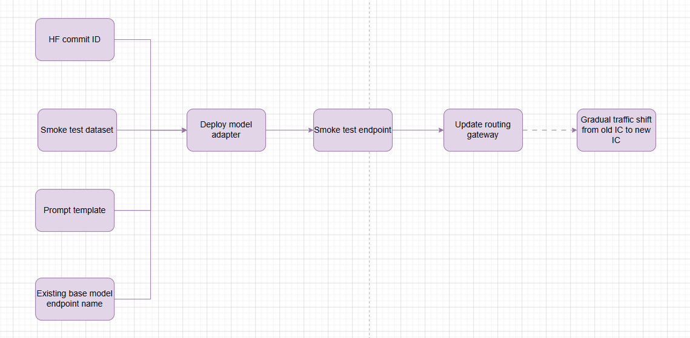
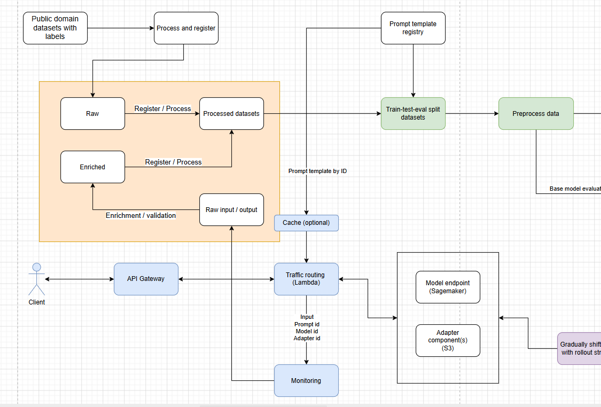
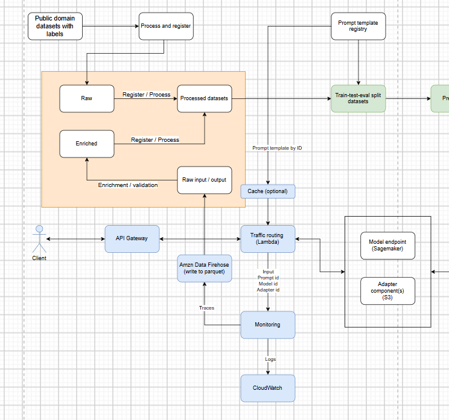

# Finetune-legal-llm-mlops
This is a project on designing and building a production-grade LLMOps platform incorporating data/training/serving/monitoring systems built using MLRun and various AWS services. It serves a fine-tuned LLM that extracts and classifies content from multi-page legal contracts up to 11,000 tokens long in structured JSON data with source quote attribution.

## Why MLRun not MLFlow for MLOps?
MLflow is a tool for tracking machine learning experiments and managing models/datasets but does not have functionality for MLOps pipeline orchestration. MLRun has all the features of MLFlow and more; it is a framework for manging all the workflows in GenAI/ML pipelines including data preparation, model training, deployment, and continuous monitoring, that can be integrated with Kubernetes/Kubeflow for scalability. 

There is an open source version, and a managed version of MLFlow provided by Iguazio. I am running this on a local machine as a substitute for the hosted version which would be used in a real project. Projects are defined by YAML files which can be shared across machines allowing the recreation of a project, this also facilitates CI/CD integration with Github Actions.

## System architecture overview
This diagram shows the general architecture that serves the model. 

The model is served with Sagemaker endpoints, traffic from clients passes through an API gateway to a serverless Lambda function that acts as a traffic gateway, logging and drift is measured on CloudWatch, and traffic movements for rolling out model updates are controlled by App Config which is initiated by MLRun. Object storate is used to store the LLM system prompt, and the model adapters created during training.

### Data processing
Pyarrow, Pandas, and Pytorch are used to process and preprocess data

### Data storage
Object storage (S3) is used to store parquet files of data the train/validation/test split due to its efficient price-to-storage ratio (unlike databases)

### Data store
While the data store is not fully implemented in this project with bucket versioning. It uses S3 to store different versions of datasets as Parquet files across different sections of the data store, delineated with different buckets. CRUD operations will be built for appending rows of operational data to datasets from log files, and data enrichment operations.

### Model
Initial testing shows that Hermes 4 at 14B parameters by Noueresearch proved to have the best performance at a low parameter count. This is a post-trained version of Qwen 3.

### Training
Model training will be done with Sagemaker training jobs using G6e instances which have 48GB VRAM. This is a cost effective instance with sufficient memory for the 2000-11000 token system prompts. It does not have NVLink so tensor parallelism strategies are infeasible, and only data parallelism is possible. The Transformers library has a trainer which will be used as it integrates well with Sagemaker andthe Hugging Model Repoistory through AWS DLC containers modified for the L40S architecture of the GPUs I am using https://aws.github.io/deep-learning-containers/reference/available_images/

### Training strategy
There is not a lot of data present in the data in the ContractNLI dataset. Fine-tuning is usually performed with a single epoch and at minimum a few thousand samples are the minimum. We only have 422 training samples, so I will use a multi-epoch strategy with early stopping based on deltas in the loss values at each observation.

### Evaluation
Custom evaluation metrics incorporating traditional ML metrics such as accuracy/recall/precision and the NLP metric ROUGE will be used to evaluate the quality of the source attribution qutoes. 

### Serving
Sagemaker model endpoints will be used for infrastructure. vLLM will be used as the inference backend due to its balance of strong performance and ease of setting up. Continuous batching is the primary inference optimisation strategy, but other options like parallelism strategies (tensor/pipeline parallelism), speculative decoding may be included.

### Deployment
The deployment workflow involves deploying either a new model or a new LoRA adapter (most of the time). I use a workflow consisting of an endpoint test that passes a baseline level of my evaluation metric, followed by a linear traffic shift while monitoring their inferences for model degradation on cloudwatch with a rollback strategy set up on App Config that will active when CloudWatch alarms are triggered.

### Drift detection: I have implemented tracking over the following metrics to detect model drift:
 - Label distribution of inferences for each hypothesis by hypothesis ID
 - Rouge precision (matching words / total words in generated text) to monitor the data inregrity of the quoted sources in the inference

### MLOps system diagram

# Pipelines in this project
* Model training job (produces adapter, loss graph on train & validation datasets)
* Model evaluation (produces performance metrics)
* Model deployment with load tests and gradual traffic shifting
* Registering prompts/models/datasets
* Data preparation

## Data problem
The data science problem explained.

### AWS DLC images (sage, EC2, ECS, EKS)
https://aws.github.io/deep-learning-containers/reference/available_images/

### Base large language model
https://huggingface.co/NousResearch/Hermes-4-14B

This is a post trained version of Qwen 3 14B

### Memory consumption
Rough guide (unsuitable):
https://docs.djl.ai/master/docs/serving/serving/docs/lmi/deployment_guide/instance-type-selection.html
### Infrastructure, GPUs, Cuda and containers
### Inference optimisation (Model & Inference service)
### Training strategy
### Registries
The model files are stored in S3 while the registry is maintained in the local MLRun project
### Evaluation and expriment tracking
### Data processing
### Pipeline orchestration
### Observability considerations
