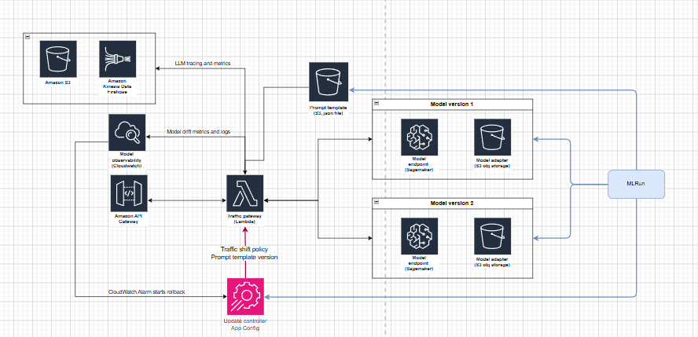
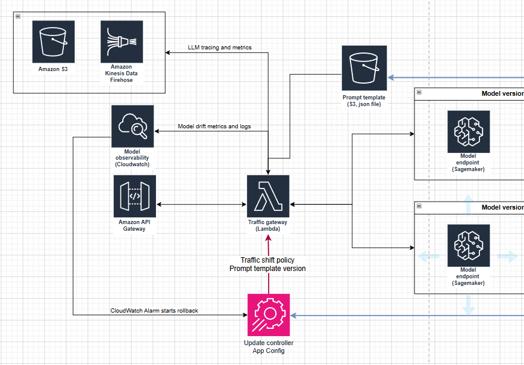
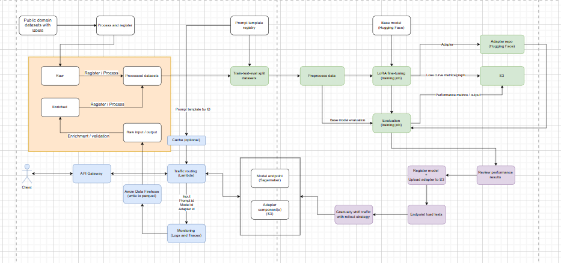

# Finetune-legal-llm-mlops
This is a project is a production-grade LLMOps (MLOps) platform for designing, building, deploying, and monitoring an in-house Large language model incorporating all the workflows in the ML lifecycle using MLRun, various AWS services, and open-source libaraies. It serves a fine-tuned LLM that understands, extracts, and classifies risk/restriction/obligation clauses from multi-page non-disclosure-agreement contracts (taken from the Contract NLI dataset https://stanfordnlp.github.io/contract-nli/) up to 11,000 tokens long, and outputs structured JSON data with classification label, and source quote attribution.

## Why MLRun not MLFlow for MLOps?
MLflow is a tool for tracking machine learning experiments and managing models/datasets but does not have functionality for MLOps pipeline orchestration. MLRun has all the features of MLFlow and more; it is a framework for manging all the workflows in GenAI/ML pipelines including data preparation, model training, deployment, and continuous monitoring, that can be integrated with Kubernetes/Kubeflow for scalability. 

There is an open source version, and a managed version of MLFlow provided by Iguazio. I am running this on a local machine as a substitute for the hosted version which would be used in a real project. Projects are defined by YAML files which can be shared across machines allowing the recreation of a project, this also facilitates CI/CD integration with Github Actions.

## Serving architecture overview
This diagram shows the general architecture that serves the model. 

The model is currently served with Sagemaker endpoints, but we are currently switching to Kubernetes (EKS) for serving. Hence the system has abstraction layer between the model serving service and the traffic entrypoint which simplifies future migration. 

Traffic from clients passes through an API gateway to a serverless Lambda function that acts as a traffic gateway, logging and drift detection is measured on CloudWatch, and traffic movements for rolling model updates with rollbacks are controlled by AppConfig which is initiated by MLRun. When a CloudWatch alarm goes off during a rolling model update, AppConfig rollsback the lambda gateway to the old traffic configuration. Object storate is used to store the LLM system prompt, and the model adapters created during training. This uses Terraform to deploy.

### Data processing
Pyarrow, Datasets, Pandas, and Pytorch are used to process and preprocess data in the data store and preprocessing before model training. PyArrow and Datasets are useful for moving and transforming large datasets because they allow files to be processed in a stream when storage is separated from compute.

### Data storage
Object storage (S3) is used to store parquet files of data the train/validation/test split due to its efficient price-to-storage ratio (unlike databases). Model inference input & output captured in a production environment during operation is traced and sent to S3 through Data Firehose so that datasets of operational data can be enriched and combined with existing training datasets - facilitating ongoing model retraining for better performance.

### Data store
While the data store is not fully implemented in this project with bucket versioning. It uses S3 to store different versions of datasets as Parquet files across different sections of the data store, delineated with different buckets. CRUD operations will be built for appending rows of operational data to datasets from log files, and data enrichment operations.

### Model
Initial testing on several open-source models shows that Hermes 4 at 14B parameters by Noueresearch proved to have the best performance at a low parameter count. This is a post-trained version of Qwen 3. The native precision if 16-bit, the native format is 16bfloat.

https://huggingface.co/NousResearch/Hermes-4-14B

### Training
Model training will be done with Sagemaker training jobs using G6e instances which have 48GB VRAM. This is a cost effective instance with sufficient memory for the 2000-11000 token system prompts. It does not have NVLink so tensor parallelism strategies are infeasible, and only data parallelism is possible. The Transformers library has a trainer which will be used as it integrates well with Sagemaker and the Hugging Model Repoistory through AWS DLC containers modified for the L40S architecture of the GPUs I am using https://aws.github.io/deep-learning-containers/reference/available_images/

I use Sagemaker training jobs on a G6e.12xlarge instance (four 48GB GPUs) because training infrastructure only needs to be transient, and spot instances are available for training which saves up to 90% of cost. Training checkpointing on S3 is available through the hugging face transformers library.

### Training strategy
There is not a lot of data present in the data in the ContractNLI dataset. Fine-tuning is usually performed with a single epoch and at minimum a few thousand samples are the minimum. We only have 422 training samples, so I will use a multi-epoch strategy with early stopping based on deltas in the loss values at each observation.

The artifacts produced during and after training are:
- Learning curves of loss for the train/eval datasets during training to check for overfitting/underfitting/convergence
- Performance metrics on test dataset and output data
- The LoRA adapter 

### Training hardware
Hardware is a major limitation in this project due to the cost of accelerated compute instances. The prompts used for training go up to over 11,000 tokens, while the output can easily exceed 2000 tokens. As such, I have to use aggressive memory reduction methods during training to not run out of memory. I am using QLoRA, a 4-bit (NF4) form of mixed precision training using `bitsandbytes`, with a memory efficient 8-bit optimiser `paged_adamw_8bit`

### Artifact repositories
I use S3 object storage to store versioned datasets, prompt templates. I use Hugging Face Model Hug Repo to store the base model, and another Repo to store versions of the LoRA adapters.

### Evaluation
Custom evaluation metrics incorporating traditional ML metrics such as accuracy/recall/precision are used to measure the "correctness" of the labels of each hypothesis, and the NLP metric ROUGE will be used to evaluate the quality of the source attribution quotes. These are the main metrics for model evaluation. 

### Serving and inference optimisation
Sagemaker model endpoints will be used for infrastructure, the backend vLLM (which uses flash attention) will be used as the inference backend due to its balance of strong performance and ease of setting up (unlike other options like TensorRT-LLM). Continuous batching and quantisation of the `model weights & KV cache` at FP8 (nearly no loss of accuracy) are the main inference optimisation strategy. Since a model fits on a single 48gb GPU, parallelism strategies (tensor/pipeline parallelism) are not necessary - each gpu on an instance (g6e.12xlarge has 4 L40S gpus) will serve independently (data parallelism).

I have to be very careful about balancing the batch size, `max-model-len`, `max-num-batched-tokens` parameters so that there are no memory bottlenecks during prefill or decode. These contract prompts are extremely long, memory has to be managed carefully.

https://docs.vllm.ai/en/latest/configuration/engine_args/?h=engine+argumen#modelconfig

Speculative decoding may be included in the future.

### Deployment
The deployment workflow involves deploying either a new model or a new LoRA adapter (most of the time). I use a workflow consisting of an endpoint test that passes a baseline level of my evaluation metric, followed by a linear traffic shift while monitoring their inferences for model degradation on cloudwatch with a rollback strategy set up on App Config that will active when CloudWatch alarms are triggered.

### Drift detection: I have implemented tracking over the following metrics to detect model drift:
 Label distribution of inferences for each hypothesis by hypothesis ID. The 3 labels are: entailment, contradiction, not_mentioned
 
 Rouge precision (matching words / total words in generated text) to monitor the data inregrity of the quoted sources in the inference

### MLOps system architecture overview

### Observability
We track a few data points during operation: Traces, Logs, Model performance metrics. Model tracing are extremely long stings of data and storing them in CloudWatch will cause cost to increase out of control - hence I use data firehose (microbatches) to write them to parquet files in S3, which also facilitates automated expansion of training datasets for `ongoing training`.

# Pipelines in this project
* Model training job (produces adapter, loss graph on train & validation datasets)
* Model evaluation (produces performance metrics)
* Model deployment for new model + adapter with load tests and gradual traffic shifting
* Model deployment for new adapter with load tests and gradual traffic shifting
* Registering prompts/models/datasets
* Data preparation

## Data problem
The data science problem explained.

### AWS DLC images (sage, EC2, ECS, EKS)
https://aws.github.io/deep-learning-containers/reference/available_images/

### Memory consumption
Rough guide (unsuitable):
https://docs.djl.ai/master/docs/serving/serving/docs/lmi/deployment_guide/instance-type-selection.html
### Infrastructure, GPUs, Cuda and containers
### Inference optimisation (Model & Inference service)
### Training strategy
### Registries
The model files are stored in S3 while the registry is maintained in the local MLRun project
### Evaluation and expriment tracking
### Data processing
### Pipeline orchestration
### Observability considerations
